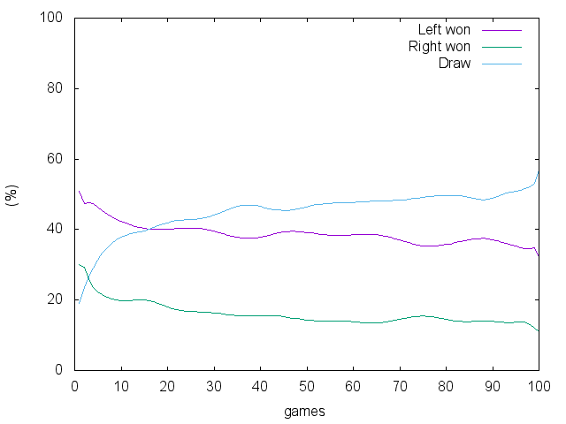

# tic-tac-toe

## players

- [x] `human` (players/human.rb)
    - user interface
- [x] `random` (players/random.rb)
    - randomly selects a empty cell
- [ ] Markov Decision Process
- [x] `q` (players/q.rb)
    - initially randomly selects and learning (Q-learning)
    - the reward offered only by win or loss

## Usage

### AI vs AI

In general,
tic-tac-toe is a game in which the left (the 1st of 2 players) is priority to the right. And the result must be draw if the 2 players are enough wise.

The former fact can be confirmed by experiments `random` vs `random`.

```bash
   ./main.rb --left random --right random -i 4000 -s | sort | uniq -c
Left: random
Right: random
 513 Draw
2353 Left won
1134 Right won
```

Above conducting 4000 games with `random` and `random`, and checking the result summary.

Then i want to check how `q` (Q-learning AI) is wise than `random`.

```bash
   ./main.rb --left random --right q -i 4000 -s | sort | uniq -c
Left: random
Right: q
1129 Draw
 875 Left won
1996 Right won

   ./main.rb --left q --right random -i 4000 -s | sort | uniq -c
Left: q
Right: random
 678 Draw
2970 Left won
 352 Right won
```

`q` seems enough wise than `random`.

### q vs q

```bash
./main.rb --left q --right q -i 10000 -s
```



Initially, left is twice stronger, since the both are almost random.
On learning, the ratios of each winning are decreasing and the ratio of draw is increasing.

## players

`cat players.yml`

```yaml
human: Human
random: RandomAI
q: Q
```

This says that 3 players are registered.
"human", "random" and "q" are the names of players.
And "Human", "RandomAI" and "Q" are the classes.
The class "Human" is denoted in "players/human.rb".
Please see `players/`.

says that there is  `RandomAI` class for an game AI written in `random.rb`.

### AI framework

A player (`class` in `name.rb`) must have following interface.

```
ai = RandomAI.new

ai.reset  # game reset

ai.run(color, state)  # return AI's action
```

where
`color` is the color of AI (`1` or `2`)
and the state is 2d-array for the game field.

## Expression of tic-tac-toe

The tic-tac-toe is 2 players game.
The 1st player called "left"
and the 2nd called "right".

A state is 2d-array sized with 3x3.
It expresses 3x3 cells.
The element of the 2d-array is `0`, `1` or `2`.
It means the colors of cells.

The initial state is repeat of `0`.

```
[[0, 0, 0],
 [0, 0, 0],
 [0, 0, 0]]
```

The left fills a `0` cell with color `1`.
The right fills a `0` cell with color `2`.

